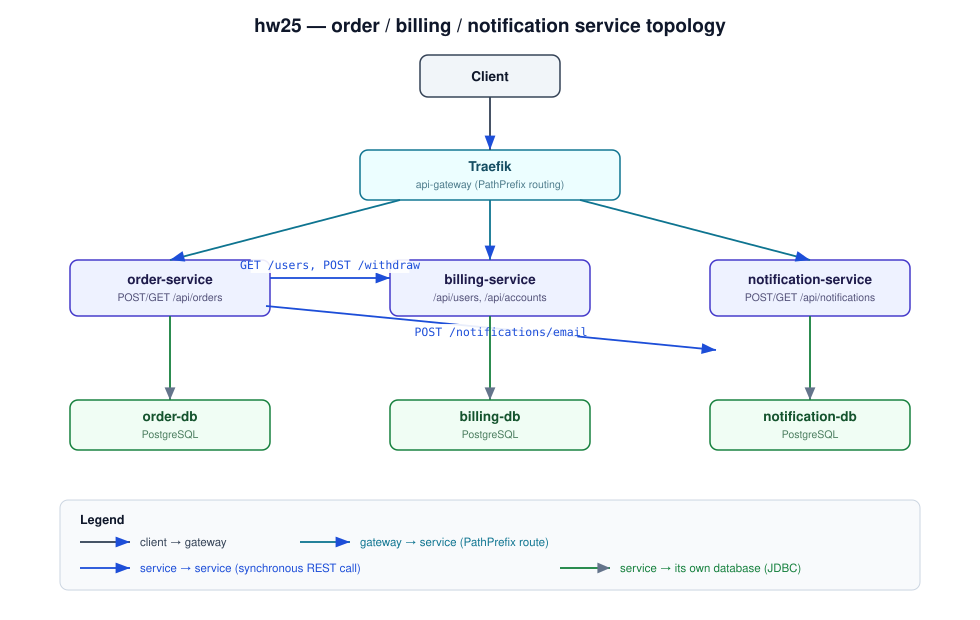
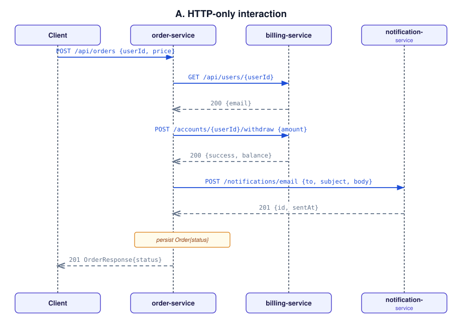
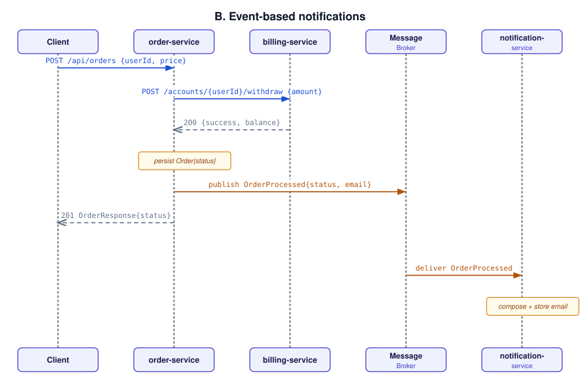
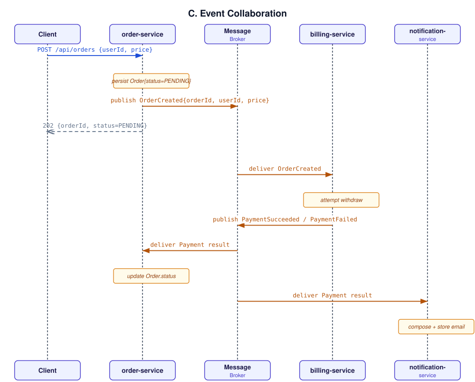

# Архитектура

Сервис `billing-service` отвечает как за пользователей, так и за их счета:
при создании пользователя в рамках той же транзакции создается и счет
с нулевым балансом. Все три сервиса работают за шлюзом Traefik, который
выполняет маршрутизацию на основе префикса пути.

- `order-service` — `POST /api/orders` управляет всем процессом обработки заказа.
- `billing-service` — `POST /api/users` создает пользователя и счет;
  `/api/accounts/{userId}/deposit|withdraw` выполняют операции с деньгами.
- `notification-service` — `POST /api/notifications/email` сохраняет email-сообщение; `GET /api/notifications?recipient=`
  позволяет получить сохраненные сообщения.

Полные описания контрактов для реализованных HTTP API находятся в файлах
  [`docs/idl/order-service-openapi.yaml`](docs/idl/order-service-openapi.yaml),
  [`docs/idl/billing-service-openapi.yaml`](docs/idl/billing-service-openapi.yaml) и
  [`docs/idl/notification-service-openapi.yaml`](docs/idl/notification-service-openapi.yaml).

## 0. Варианты взаимодействия при создании заказа

Процесс обработки заказа в рамках задания включает следующие этапы: **(1)** списание средств через `billing-service`,
**(2)** отправка пользователю уведомления по электронной почте в зависимости от результата. Ниже представлены
четыре обязательных варианта взаимодействия; каждая диаграмма последовательности выполнена в формате SVG.

### A. Взаимодействие исключительно по HTTP (**реализовал этот вариант**)

`order-service` вызывает `billing-service` и `notification-service` синхронно,
в указанном порядке, возвращает ответ клиенту только после завершения обоих вызовов
(а также записи данных в локальную таблицу `orders`).

### B. Событийно-ориентированное взаимодействие с использованием брокера сообщений для уведомлений

Этап оплаты остается синхронным, однако отправка уведомления по электронной почте
выполняется независимо: `order-service` публикует событие `OrderProcessed` и сразу возвращает ответ клиенту,
а `notification-service` считывает это событие и отправляет письмо по собственному графику.

IDL: [`docs/idl/notification-events-asyncapi.yaml`](docs/idl/notification-events-asyncapi.yaml)
(AsyncAPI) для канала `order.processed`; для самого вызова биллинга по-прежнему используется
файл `billing-service-openapi.yaml`. 

### C. Стиль взаимодействия на основе событий с использованием брокера сообщений

Сервисы не вызывают друг друга напрямую. `order-service` сохраняет заказ со статусом `PENDING` и публикует событие `OrderCreated`; 
`billing-service` пытается списать средства и публикует `PaymentSucceeded` или `PaymentFailed`;
`order-service` и `notification-service` подписываются на этот результат — первый обновляет статус заказа, второй отправляет электронное письмо.
Клиент сразу получает ответ с заказом в статусе `PENDING` и должен либо периодически опрашивать систему, либо оформить отдельную подписку, чтобы получить итоговый результат.

IDL: [`docs/idl/event-collaboration-asyncapi.yaml`](docs/idl/event-collaboration-asyncapi.yaml)
(AsyncAPI) для событий `order.created`, `payment.succeeded` и `payment.failed`.

## I. Схема взаимодействия сервисов

Схема топологии, приведенная в начале этого документа
([`docs/diagrams/00-architecture.svg`](docs/diagrams/00-architecture.svg)),
и реализованная диаграмма последовательности
([`docs/diagrams/01-http-only-sequence.svg`](docs/diagrams/01-http-only-sequence.svg)).